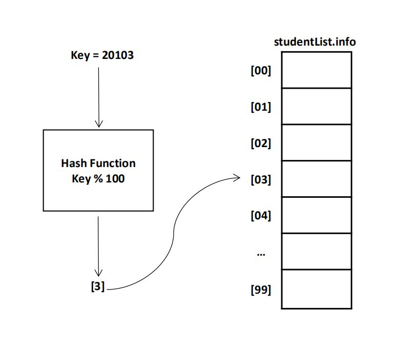

<p style="align: center;"><h1>Hash Tables</h1></p>
<p><h4>What is a hash table?</h4></p>
A hash table is an effective data structure for implementing dictionaries. Under reasonable assumptions, the average time to search for an element in a hash table is O(1).

A hash table generalizes the simpler notion of an ordinary array. Directly addressing into an ordinary array makes effective use of our ability to examine an arbitrary position in an array in O(1) time.

<p><h4>Hash Function</h4></p>
A function that manipulates the key to produce an array index.
<p align="center">
  
</p><br>
<p><h4>What makes a good hash function?</h4></p>
A good hash function minimizes collisions, but they’re impossible to completely avoid.
<br>
<p><b>Collision:</b><span> When multiple keys produce the same hash location.</span></p>

```C++
//1. Returns an integer between 0 and MAX_ITEMS -1.
int ItemType::Hash() const
{
  return (id_num % MAX_ITEMS);
}

//2. Returns the element in the array at position item.Hash().
void ListType<ItemType>::GetItem(ItemType& i)
{
  int location;
  location = i.Hash();
  i = info[location];
}
```
<br>
<p><h4>Handling Collisions</h4></p>
<hr style="width: 37%;">
<p><h4>Linear Probing</h4></p>
Resolves hash collisions by searching for the next available space
If the end of the hash is reached, linear probing loops around to the beginning.
