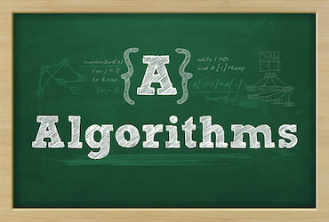

## Algorithms

"Before there were computers, there were algorithms."
&nbsp;&nbsp;

  

 
Each folder in this repository will be representing one of the most important and most commonly used algorithms.
 
<li>Hash Tables</li>
<li>Linked Lists</li>
<li>Stacks and Queues</li>
<li>Trees and Graphs</li>
        
<b>References</b>
 
<li>Introduction to Algorithms/ Thomas H. Cormen, The MIT Press Cambridge, Massachusetts.</li>
