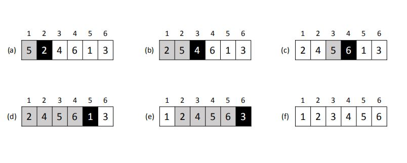
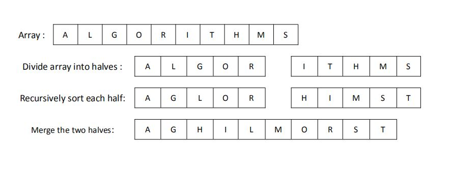
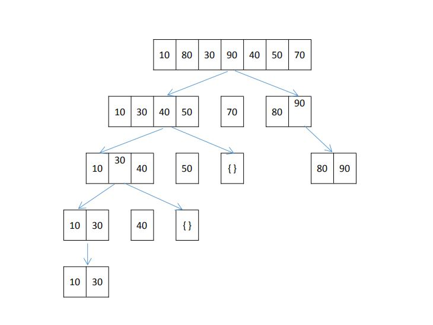
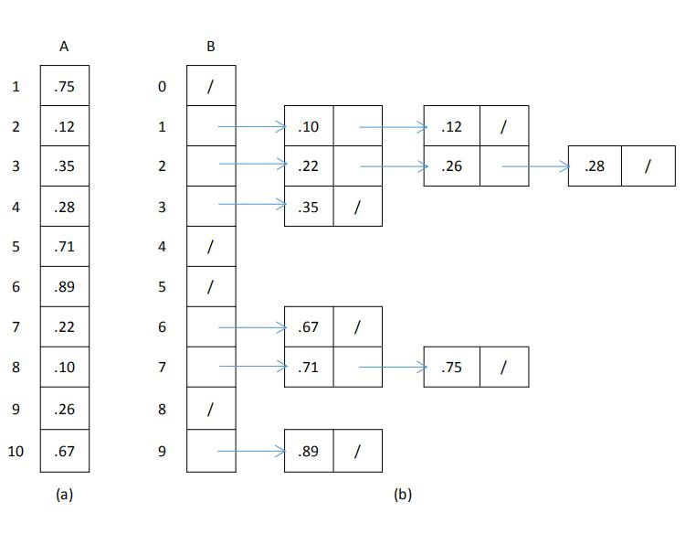

## Sorting Algorithm
A sorting algorithm describes the method by which we determine the sorted order.

### Why Sorting?
* Algorithms often use sorting as a key subroutine.
* Many important techniques used throughout algorithm design appear in the body of sorting algorithms that have been developed over the years.
* We can prove a nontriviallower bound for sorting.Best upper bounds match the lower bound asymptotically, so we know that our sorting algorithms are asymptotiacally optimal.
* Many engineering issues come to the fore when implementing sorting algorithms.

-----------------------------
&nbsp;
Algorithm | Worst-case running time |  Average-case/expected running time
------------ | ------------- | -------------
**Insertion sort** | $\Theta (n^2)$ | $\Theta (n^2)$
**Merge sort** | $\Theta(n log n)$ | $\Theta(n log n)$
**Heapsort** | $O(n log n)$ | __
**Quicksort** | $\Theta (n^2)$ | $\Theta(n log n)$ (expected)
**Counting sort** | $\Theta (k + n)$ | $\Theta (k + n)$
**Radix sort** | $\Theta (d(n + k))$ | $\Theta (d(n + k))$
**Bucket sort** | $\Theta (n^2)$ | $\Theta (n)$ (average-case)

-----------------------------

### Insertion sort
Insertion sort is an efficient algorithm for sorting a small number of elements. It works the way people sort a hand of playing cards. We start with an empty left hand and the cards face down on the table, then remove one card at a time from the table and insert it into the correct position in the left hand. To find the correct position for a card, we compare it with each of the cards already in the hand, from right to left.


```
INSERTION-SORT(A)
for j = 2 to A.length
  key = A[j]
  // Insert A[j] into the sorte sequence A[1 .. j-1]
  i = j - 1
  while i $>$ 0 and A[i] $>$ key
    A[i + 1] = A[i]
    i = i - 1
  A[i+1] = key
```
-----------------------------

### Merge sort
Given a sequence of n numbers, the following algorithm sorts the sequence in ascending order.

```
Algorithm MergeSort(S)
if |S| = 1 then
  return (S);
else
  Divide S into two sequences S1 and S2 of equal size;
  return (merge (MergeSort(S1), MergeSort(S2)));
```

Example :

-----------------------------

### Heap sort
* A simple sort algorithm is to search for the highest value, insert it at the last position, repeat for the next highest value, and so on
* Searching for the next highest value in the list makes this selection sort inefficient
* By using a heap, there is no need to search for the next largest element
* Remove the root, ReheapDown, repeat

```C++
void HeapSort(ItemType values[], int numValues)
{
  int index;
  // Convert the array of values into a heap.
  for (index = numValues/2 - 1; index >= 0; index--)
    ReheapDown(values, index, numValues-1);
    // Sort the array.
    for (index = numValues-1; index >= 1; index--)
    {
        Swap(values[0], values[index]);
        ReheapDown(values, 0, index-1);
    }
}
```
-----------------------------

### Quicksort
Randomized Divide and Conqur: Finding the Median and Quicksort

Suppose we are given a st of n numbers S = {$a_{1}$, $a_{2}$, ..., $a_{n}$}. Their median is  the number that would be in the middle position if we were to sort them. The median of S is equal to the $k^{th}$ largest element in S where k = (n + 1)/2 if n is odd, and k = n/2 if n is even.
Consider the function Select(S, k) that returns the $k^{th}$ largest element in S. The basic structure of the algorithm implementing Select is as follows:

Select(S, k):
Choose a splitter a_{i} \in S
For each element $a_{j}$ of S
&emsp;Put $a_{j}$ in $S^{-}$ if $a_{j}$ $<$ $a_{i}$
&emsp;Put $a_{j}$ in $S^{+}$ if $a_{j}$ $>$ $a_{i}$
Endfor
If |$S^{-}$|=k-1 then
&emsp;The splitter $a_{i}$ was in fact the desired answer
Else if |$S^{-}$| $\geq$ k then
&emsp;The $k^{th}$ largest element lies in $S^{-}$
&emsp;Recursively call Select($S^{-}$,k)
Else suppose |$S^{-}$|= l $<$k-1
&emsp;The $k^{th}$ largest element lies in $S^{+}$
&emsp;Recursively call Select($S^{+}$,k-1-l)
Endif

Example


-----------------------------

### Counting sort
Counting sort assumes that each of the n input elements is an integer in the range 0 to k, for some integer k. When k = O(n), the sort runs in $\Theta$(n) time.

COUNTING-SORT(A,B,k)
let C[0..k] be a new array
for i = 0 to k
&emsp;C[i] = 0
for j = 1 to A.length
&emsp;C[A[j]] = C[A[j]] + 1
// C[i] now contains the number of elements equal to i.
for i = 1 to k
&emsp;C[i] = C[i] + C[i-1]
// C[i] now contains the number of elements less than or equal to i.
for j = A.length downto 1
&emsp;B[C[A[j]]] = A[j]
&emsp;C[A[j]] = C[A[j]]-1

-----------------------------

### Radix sort
Radix sort is the algorithm used by the card-sorting machines. The cards have 80 columns, and in each column a machine can punch a hole in one of 12 places. The sorter can be mechanically programmed to examine a given column of each card in a deck and distribute the card into one of 12 bins.
Radix sort solves the problem of card sorting, by sorting on the least significant digit first. The algorithm then comines the cards into a single deck, with the cards in the 0 bin preceding the cards in the 1 bin preceding the cards in the 2 in and so on.

RADIX-SORT(A,d)
for i = 1 to d
&emsp; use a statle sort to sort array A on digit i

-----------------------------

### Bucket sort
Bucket sort assumes that the input is drawn from a uniform distribution and has an average-case running time of O(n).



BUCKET-SORT(A)
let B[0..n-1] be a new array
n = A.length
for i = 0 to n-1
&emsp;make B[i] an empty list
for i = 1 to n
&emsp;insert A[i] into list B[[nA[i]]]
for i = 0 to n-1
&emsp;sort list B[i] with insertion sort
concatenate the lists B[0], B[1], ..., B[n-1] together in order
